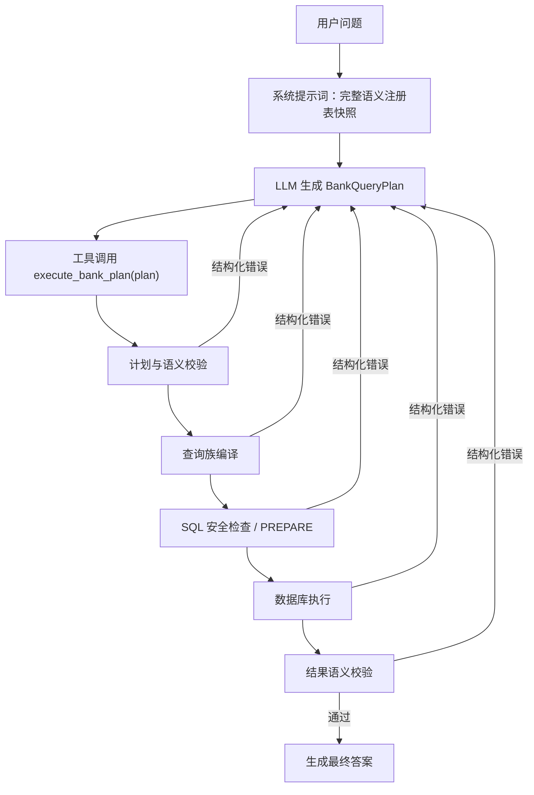

# 银行问数 LLM Agent 提分改造事实方案

> 状态：`FACTUAL_DRAFT`，用于继续需求对齐，不代表已实施、已部署或已取得新分数。
> 评测口径已收口：本文任何历史局部结果均不再可用；唯一当前成绩由
> `Run-OfficialBankEvaluation.ps1` 产生的 Fact v3 `caseAccuracy` 决定。
> 事实快照：Git `c7c1f59`（`experiment/bank-path-ablation` 的已提交 HEAD），2026-08-09。
> 规划分支：`codex/llm-agent-score-plan`。
> 本文只新增方案文档，不修改业务代码、运行时配置、Agent 33、H2、正式数据集或评测结果。

## 1. 结论摘要

推荐把银行问数主路线改造成：

```text
完整且版本化的银行语义目录
  -> LLM 生成受约束 BankQueryPlan
  -> 用户可见的 execute_bank_plan 工具调用
  -> 计划校验 / 编译 / SQL 安全检查 / 数据库执行 / 结果语义检查
  -> 失败详情作为 tool result 回到同一轮模型上下文
  -> LLM 修正完整计划并再次调用工具
  -> 校验通过后生成最终自然语言答案
```

方案设计评分为 **87/100**。这是架构评估分，不是竞赛准确率。预计准确率提升属于待验证假设，不能写成既成事实。

方案的主要价值：

1. 让大模型负责自然语言到业务语义计划的翻译，提高未见表达的泛化能力。
2. 让确定性组件负责合法性、编译、安全和执行，不让模型直接生成物理 SQL。
3. 把格式、语义、编译、数据库和结果错误完整反馈给模型，形成可纠正闭环。
4. 把工具调用和工具结果展示给用户，提高可解释性和问题诊断效率。
5. 用同一事实注册表生成提示词、Schema、校验规则和 UI 说明，避免多份目录漂移。

## 2. 目标与非目标

### 2.1 目标

- 以任务书对最终结果正确性的要求建立全分母 `caseAccuracy`，同时保留 SQL 执行成功率和全链路延迟硬门禁。
- LLM 主导用户自然语言到 `BankQueryPlan` 的转换。
- 模型能感知所有允许参数、取值、业务含义、单位、公式和组合约束。
- 同一用户提问内允许多次模型修正，每次工具调用过程对用户可见。
- 错误反馈不包含金标答案、金标行或官方 SQL。
- TRAIN 用于分析和优化，DEV 用于选型，TEST 只用于冻结后的最终验收。

### 2.2 非目标

- 不让模型直接生成或执行自由物理 SQL。
- 不按样本 ID、完整题面或标准答案编写专用分支。
- 不用 SQL 字符串相似度作为主分。
- 不通过修改正式数据集或降低评分标准制造虚假提分。
- 不把模型私有思维过程展示给用户；只展示计划摘要、工具调用、工具结果和修正动作。
- 本轮评测协议修复不修改 Agent、数据库、运行服务、正式数据资产、分支历史或 PR。

## 3. 已确认事实

### 3.1 正式数据与评分契约

- 当前正式评估库版本为 `2.0.1`；`2.0.0` 作为不可变父版本保留。
- 正式题目总数为 199，切分固定为：TRAIN 119、DEV 40、TEST 40。
- 另有 12 条 `augmentation.jsonl` 增强样本，不参与官方评分。
- 赛题文件没有定义总分公式；历史的缩小分母与严格行结构口径均不能作为当前成绩。
- 当前协议主指标为全分母 `caseAccuracy = resultExact`；最终回答仅作非计分展示，SQL 文本和 AST 不计分。
- 结构化执行结果仅作为 `resultExact` 的事实证据，不单独形成成绩。
- 批量评测器通过 `/openapi` 模拟前端链路，每题使用独立新会话；页面采集器只作为手工 UI 诊断工具。
- TEST 金标具有显式读取门禁，最终测试需要 `--acknowledge-final-test`。

事实来源：

- `evaluation/bank_nl2sql/README.md`
- `evaluation/bank_nl2sql/official/2.0.1/official-manifest.json`
- `evaluation/bank_nl2sql/Run-OfficialBankEvaluation.ps1`

### 3.2 当前最佳已提交 bank-on 配置

`evaluation/bank_nl2sql/repro/best_bank_on.json` 在 2026-08-08 记录的已知最佳配置为：

| 参数 | 当前记录值 |
| --- | --- |
| `s2.parser.bank.constrained-plan.enable` | `true` |
| `s2.parser.bank.max-candidates` | `1` |
| `s2.parser.bank.plan.thinking.enable` | `false` |
| `s2.parser.bank.plan.deterministic-short-circuit.enable` | `false` |
| `s2.parser.bank.plan.soft-fallback.enable` | `true` |
| Agent 33 `BANK_CONSTRAINED_PLAN` | 启用 |
| Agent 33 `EXECUTION_SQL_CORRECTOR` | 建议启用 |

已记录证据：

- hard20 与 reg21 仅保留为历史局部工程观察，不能导出当前效果结论。
- 这些是局部消融证据，不等于 TRAIN 119、DEV 40 或 TEST 40 的全量正式成绩。
- 当前记录显示 `max-candidates=2` 没有改善历史局部结果，但增加了延迟。
- 当前记录显示关闭 `soft-fallback` 会造成历史局部解析和执行回归。

### 3.3 当前全量 TRAIN 报告

本地报告：

```text
.local-dev/bank-nl2sql/candidate-train-full-20260809.json
```

已核实摘要：

| 指标 | 结果 |
| --- | ---: |
| 记录数 | 119 |
| 完成数 | 119 |
| 解析成功率 | 100% |
| 执行成功率 | 95.7983%（114/119） |
| 历史严格行结构结果 | 85.7143%（102/119） |
| 执行错误 | 5 |
| 结果不匹配 | 12 |
| 平均端到端耗时 | 18.879 秒 |
| P95 端到端耗时 | 54.970 秒 |

证据边界：

- 该报告统计的是严格列名/行结构相等的历史口径，没有可直接作为新主基线的事实级结果与最终文本摘要。
- 因此 `102/119=85.7143%` 不能直接称为当前官方主指标成绩。
- 在任何提分宣称前，必须用冻结后的 v3 评分器重新建立全量 TRAIN `caseAccuracy` baseline。

### 3.4 当前计划生成链路

当前代码已经具备以下能力：

- `BankQueryPlan` 作为模型输出的受约束语义产物。
- `BankPlanPromptComposer.FIXED_SYSTEM_PREFIX` 已列出顶层字段、指标代码、机构代码和若干结构骨架。
- `BankPlanGenStrategy` 支持候选生成、计划解析/校验错误反馈、两次 repair 和一次 cold replan。
- `BankQueryPlanCompiler`、`BankS2SqlTemplateFactory`、`BankResultProjector` 和执行协调器承接计划后的确定性路径。
- `BankPlanLlmPrefixCache` 可复用固定系统前缀。

当前已发现缺口：

1. repair 主要覆盖计划解析/校验，未形成统一的“编译 -> SQL 检查 -> DB 执行 -> 结果语义”反馈闭环。
2. 工具调用和修正过程没有作为稳定产品协议展示给用户。
3. 系统目录、`BankQueryPlan.JSON_SCHEMA` 和校验器分开维护，存在漂移风险。
4. 已存在一个具体漂移：JSON Schema 支持 `HALF_YEAR`，当前系统提示词的粒度目录没有列出 `HALF_YEAR`。
5. `filters` 的字段、操作符和值域没有完整枚举。
6. `output.columns` 不能完整表达当前值、基期值、变化额、变化率、全省均值、排名等输出事实角色。
7. 当前实现仍保留规则 `soft-fallback`，模型全拒后可能由规则计划接管。
8. 当前桌面 `experiment/bank-path-ablation` 工作树包含未提交修改；本文不吸收、覆盖或提交这些修改。

## 4. 目标架构



### 4.1 责任边界

| 组件 | 负责 | 不负责 |
| --- | --- | --- |
| LLM | 理解用户表达、选择业务参数、生成或修正完整计划 | 直接写物理 SQL、绕过白名单、读取金标 |
| Semantic Registry | 定义全部参数、含义、别名、单位、公式、约束和版本 | 依据具体评测题生成答案 |
| Plan Validator | 校验计划字段、组合约束和业务能力边界 | 猜测用户意图 |
| Compiler / Template | 把合法计划确定性编译为 S2SQL/SQL | 改写用户语义 |
| Execution Tool | 安全检查、执行、采集阶段结果 | 使用金标判断正确答案 |
| Result Semantic Validator | 检查结果形状、覆盖范围、事实角色、单位和空结果 | 在运行时比较官方标准答案 |
| UI | 展示计划摘要、工具步骤、错误和最终结果 | 展示模型私有思维链 |
| Evaluator | 离线比较SQL结果事实与最终文本事实，计算全分母 `caseAccuracy` | 参与运行时纠错 |

## 5. 唯一语义注册表

应新增或明确一个唯一权威的 `BankSemanticRegistry`。系统提示词、JSON Schema、validator、compiler capability、UI 字段说明和评测 trace 均从该注册表生成或引用，禁止继续复制多份手工目录。

注册表至少包含：

### 5.1 计划字段

- `version`
- `action`
- `intent`
- `metrics`
- `derivedMetrics`
- `dimensions`
- `organizations`
- `time`
- `filters`
- `calculation`
- `orderBy`
- `limit`
- `output`

每个字段必须描述：类型、必填条件、允许值、默认值、互斥项、依赖项和示例形状。

### 5.2 指标目录

每个指标至少包含：

```text
code
name
aliases
description
unit
defaultAggregation
supportedAggregations
direction (HIGHER_BETTER / LOWER_BETTER / NEUTRAL)
formula
dependencies
supportedIntents
supportedOutputFacts
```

当前 ZB001～ZB021 和所有派生指标必须完整覆盖。

### 5.3 机构目录

每个机构至少包含：

```text
code
name
aliases
scope
```

需要明确：单机构、多个机构、全省范围和“哪家/各家”等表达的含义。

### 5.4 时间目录

至少覆盖：

- `DAY / MONTH / QUARTER / HALF_YEAR / YEAR / RANGE`
- `NONE / YEAR_OVER_YEAR / PERIOD_OVER_PERIOD / START_OF_YEAR / MOM_AND_YOY`
- 绝对日期、月末、季末、年末、去年同期、年初、日均、期间平均等口径。
- 每种 comparison 的当前期、基期必填规则和日期对齐规则。

### 5.5 过滤与排序目录

必须完整定义：

- 合法 filter field。
- `EQ / NE / GT / GTE / LT / LTE / IN / NOT_IN / BETWEEN / COMPARE` 等实际支持操作符。
- 每个 field/operator 的合法值域。
- 排名、阈值、全省均值比较的特殊约束。

### 5.6 输出事实目录

推荐至少定义：

```text
METRIC_VALUE
CURRENT_VALUE
BASELINE_VALUE
ABSOLUTE_CHANGE
PERCENT_CHANGE
VALUE_DIFFERENCE
RATIO_PERCENT
RANK_POSITION
PROVINCIAL_AVERAGE
DAYS_ABOVE_AVERAGE
TOTAL_DAYS
DAILY_AVERAGE
MINIMUM_VALUE
MAXIMUM_VALUE
COMPARISON_TYPE
METRIC_ROLE
```

每个输出事实必须定义：含义、数据类型、单位、所需输入、适用 intent、输出列和结果校验规则。

## 6. 工具调用与完整纠错协议

### 6.1 模型侧工具

推荐只暴露一个稳定复合工具：

```text
execute_bank_plan(plan: BankQueryPlan) -> BankPlanToolResult
```

模型不需要直接管理所有 Java 底层组件。工具内部依序执行各阶段，并通过流式事件向 UI 展示。

### 6.2 工具结果

`BankPlanToolResult` 至少包含：

```text
attempt
status
failedStage
errorCode
message
previousPlanFingerprint
stageResults
allowedValues
correctionHints
compiledQuerySummary
resultSchema
resultPreview
traceId
```

失败阶段枚举：

```text
PLAN_SCHEMA
PLAN_SEMANTIC
COMPILE
SQL_SAFETY
DATABASE_PREPARE
DATABASE_EXECUTE
RESULT_SEMANTIC
```

禁止返回：金标答案、金标行、官方 SQL、题号专用提示或“正确数值应该是多少”。

### 6.3 自动修正

同一用户提问的每次修正上下文包含：

- 原始用户问题。
- 当前系统语义目录版本。
- 上一版完整 `BankQueryPlan`。
- 上一版 plan fingerprint。
- 精确失败阶段、错误代码、错误事实和允许值。
- 已执行步骤的摘要。

推荐默认最多 3 次计划工具调用：

1. 第一次生成。
2. 第一次纠正。
3. 最终纠正。

提前终止条件：

- 相同计划 fingerprint 重复。
- 相同错误代码与关键参数重复两次。
- 数据库不可用或模型服务不可用。
- 发现需要用户补充的不可约歧义。

达到上限后必须展示失败详情并请求用户澄清，不能静默伪造成功。

### 6.4 用户可见 trace

用户可见内容：

```text
正在理解问题
工具调用 #1：计划摘要
计划校验：通过/失败
查询编译：通过/失败
数据库执行：通过/失败
结果检查：通过/失败
根据错误修正计划
工具调用 #2：修正摘要
最终答案或需要澄清的问题
```

用户不可见内容：模型私有 token 级推理、隐藏系统提示词、密钥、数据库凭据和完整内部堆栈。

## 7. 示例与检索策略

### 7.1 已对齐目标

此前需求要求：示例只能来自 TRAIN；TRAIN 自测时排除当前题，DEV/TEST 也只能检索 TRAIN。

### 7.2 当前仓库政策冲突

当前根 `AGENTS.md` 和 `BEST_BANK_ON.md` 明确禁止：

- 把 TRAIN 原始自然语言问题作为 few-shot 放入运行时 prompt。
- 把 TRAIN gold SQL、标准答案数字或完整题面写入提示词。

因此“TRAIN-only 示例”存在尚未解决的产品/合规分叉。

### 7.3 推荐处理

推荐采用 **TRAIN-derived abstract prototypes**，而不是 raw TRAIN NL few-shot：

- 允许：从 TRAIN 失败归纳的抽象查询族、字段骨架、语义同义词和纠错模式。
- 允许：不含题号、不含完整原题、不含答案数字、不含 gold SQL 的合成问题/计划对。
- 禁止：原始 TRAIN 问句原文与其金标计划直接拼入运行时上下文。

若用户坚持使用原始 TRAIN NL few-shot，需要先明确修改仓库反作弊政策，并重新评估竞赛合规性；在此之前不进入实施。

## 8. 评测与提分实验

### 8.1 候选主指标

Primary：

```text
caseAccuracy = casePass / split 全部题数
casePass = resultExact
```

其中 `resultExact` 按 SQL 执行结果中的必答事实评分，列名、投影结构、SQL 文本和 AST 不参与主判定；最终回答仅用于用户展示，不参与主判定。

Secondary：

```text
resultExact
finalAnswerProcessorSuccessRate
contractReadyRate
parseSuccessRate
executionSuccessRate
firstPassPlanValidity
repairRecoveryRate
averageAttempts
endToEnd P50/P95
previouslyPassingRegressions
```

### 8.2 基线重建

在任何候选优化前：

1. 固定 Git commit、Agent 33 配置、模型端点/模型名、H2 数据库版本、数据集 manifest、提示词版本和语义目录版本。
2. 使用当前最佳 bank-on 配置运行 TRAIN 119。
3. 先运行固定 smoke，要求全绿；再由 `Run-OfficialBankEvaluation.ps1` 顺序运行 train 与 dev，保证全分母。
4. 从统一运行报告读取 `caseAccuracy` baseline，不允许通过排除题目缩小分母。
5. 保存运行元数据、结果和分类型失败清单。

当前 `85.7143%` 只能作为历史行结构参考，不能作为新 baseline。

### 8.3 消融顺序

| Cell | 唯一主要变量 | 目的 |
| --- | --- | --- |
| A | 当前 best bank-on | 新 `caseAccuracy` 基线 |
| B | A + 唯一语义注册表生成的完整系统提示词 | 测量完整参数感知收益 |
| C | B + 全阶段 tool-result repair | 测量纠错恢复收益 |
| D | C + 用户可见 trace | 验证产品可观测性；理论上不应改变准确率 |
| E | D + 合规的抽象原型检索 | 测量词面泛化收益 |
| F | E + 仅对高不确定问题启用多候选 | 测量准确率/延迟取舍 |

一个 cell 只改变一个主要机制。D 的 UI 可见性与 C 的模型反馈必须分别度量，避免把 UI 改造误算成模型提分。

### 8.4 最小决定性评测

开发迭代使用：

```text
当前失败题
+ 同查询族已通过保护题
+ 10 条跨类型保护样例
```

候选有正向信号后再跑完整 TRAIN。

晋级建议：

- 当前失败题新增通过至少 3 题。
- 保护集无系统性回退。
- 完整 TRAIN 净增至少 3 题。
- 原通过题新增失败不超过 1 题，且必须逐条审查。
- 解析成功率保持 100%。
- 执行成功率目标不低于 98%。
- 平均工具调用次数不高于 1.5。
- 相对基线 P95 延迟不超过预先确认的预算。

### 8.5 数据使用顺序

```text
TRAIN 119：失败分析、提示词/注册表/纠错优化
DEV 40：选择最终配置、重试次数和检索策略
TEST 40：代码、配置、数据全部冻结后的最终验收
```

禁止根据 TEST 失败内容继续调参或添加规则。

## 9. 预期收益与证据等级

以下是待验证假设，不是承诺：

| 阶段 | 假设 |
| --- | --- |
| 完整目录 + LLM 主导 | 减少指标、机构、时间、输出事实选择错误 |
| 全阶段 repair | 恢复计划、编译、执行和部分结果语义失败 |
| 抽象原型检索 | 提高未见词面和近义表达泛化 |
| 高不确定多候选 | 提高复杂歧义题准确率，但增加延迟 |

在 v3 事实合同全部 READY、全量 baseline 可复现后，阶段性 `caseAccuracy` 目标可设为：

- 第一阶段：89%～92%。
- 第二阶段：92%～95%。
- 稳定后：争取 95% 以上。

这些区间只有在全分母 baseline、消融和 DEV 结果产生后才能升级为证据。

## 10. 预计影响面

后续实施预计涉及：

### 后端计划与语义

- `headless/chat/.../bank/BankQueryPlan.java`
- `headless/chat/.../bank/BankPlanPromptComposer.java`
- `headless/chat/.../bank/BankPlanGenStrategy.java`
- `headless/chat/.../bank/BankQueryPlanValidator.java`
- 新增或扩展唯一 `BankSemanticRegistry`

### 编译、执行与结果契约

- `BankQueryPlanCompiler`
- `BankS2SqlTemplateFactory`
- `BankNl2SqlExecutionCoordinator`
- `BankResultProjector`
- 新增 `BankPlanToolResult` / trace event 契约

### API 与前端可观测性

- Chat 查询响应中的工具事件/诊断字段
- `webapp/packages/chat-sdk`
- 可复用现有 `TrustExplanationPanel`，展示工具步骤而非新建平行聊天系统

### 评测与复现

- `evaluation/bank_nl2sql/Run-OfficialBankEvaluation.ps1`
- `evaluation/bank_nl2sql/official_runtime_evaluation.py`
- `evaluation/bank_nl2sql/repro/best_bank_on.json`
- 消融报告输出和 trace 统计

保护边界：

- 不覆盖 `official/2.0.0`；答案修正通过增量2.0.1版本、修正账本和哈希链发布。test与事实区域保持不变。
- 不修改 H2 或 Agent 33，除非进入独立部署/评测阶段并再次核验运行时 owner。
- 不覆盖桌面脏工作树中的未提交改动。

## 11. 实施任务图

模式：`TASK_GRAPH`。原因是存在合规决策、跨模块公共契约、前后端可观测性、运行时评测和独立晋级门禁。

### Critical Path

```text
Task 0 合规与产品分叉定稿
  -> Task 1 唯一语义注册表与计划契约
  -> Task 2 复合执行工具与全阶段纠错
  -> Task 3 用户可见 trace
  -> Task 4 新 caseAccuracy baseline 与 A/B/C/D 消融
  -> Task 5 合规抽象原型检索
  -> Task 6 TRAIN/DEV 晋级与 TEST 冻结验收
```

### Task 0：定稿两个高影响分叉

- Owner/Boundary：产品与竞赛合规；只更新方案/准则，不改运行时代码。
- 依赖：本文 §7 和 §12。
- Mode：SIMPLE。
- Verification/Stop：明确“原始 TRAIN NL few-shot 是否允许”和“soft-fallback 最终策略”；未定稿则停止实施。

### Task 1：建立唯一语义注册表

- Owner/Boundary：计划 Schema、提示词目录、validator capability；不改数据库和金标。
- 依赖：Task 0。
- Mode：BDD_TDD。
- Verification/Stop：提示词、Schema、validator 枚举完全一致；覆盖 `HALF_YEAR`、filter、output facts；发现目录事实不清则停止。

### Task 2：建立 `execute_bank_plan` 与全阶段纠错

- Owner/Boundary：后端计划、编译、执行、结果语义 trace；不改变合法查询族结果。
- 依赖：Task 1。
- Mode：BDD_TDD。
- Verification/Stop：七个失败阶段均能产生结构化错误并回送模型；合法计划结果不回归；不得返回金标。

### Task 3：展示用户可见工具链

- Owner/Boundary：Chat API 事件和 chat-sdk 展示；不改变模型决策。
- 依赖：Task 2 的 trace schema。
- Mode：BDD_TDD。
- Verification/Stop：页面可看到每次计划摘要、阶段结果、修正和终态；不展示私有思维链与敏感信息。

### Task 4：重建 baseline 并完成核心消融

- Owner/Boundary：评测与 score loop；不修改候选实现。
- 依赖：Tasks 1～3。
- Mode：SIMPLE。
- Verification/Stop：A/B/C/D 同数据、同模型、同配置；输出 `caseAccuracy`、`resultFactsExact`、失败类型、恢复率和延迟；最终回答处理状态仅作诊断；不能解析结果则停止晋级。

### Task 5：加入合规抽象原型检索

- Owner/Boundary：只使用不含 raw TRAIN NL/gold 的抽象原型；不读取 TEST 金标。
- 依赖：Task 0 决策和 Task 4 baseline。
- Mode：BDD_TDD。
- Verification/Stop：TRAIN leave-one-out；DEV 只用 TRAIN-derived 原型；检测到题面或答案泄漏立即停止。

### Task 6：完成 TRAIN/DEV 晋级和 TEST 最终验收

- Owner/Boundary：评测与冻结发布；不在 TEST 后继续调参。
- 依赖：Task 5 或明确跳过检索。
- Mode：SIMPLE。
- Verification/Stop：达到晋级门槛后冻结 commit/config/catalog/model/dataset；TEST 仅运行一次正式候选。

## 12. 待继续对齐的决策

### 决策 A：TRAIN 示例到底允许到什么程度

推荐：

```text
不使用 raw TRAIN NL few-shot；
只使用由 TRAIN 归纳但不保留原题、答案和 gold SQL 的抽象原型。
```

原因：符合当前仓库反作弊政策，同时仍能向模型提供查询族、同义词和纠错知识。

需要用户确认：是否接受这个边界；若不接受，需要先修改仓库政策并重新审查竞赛合规性。

### 决策 B：`soft-fallback` 如何处理

现有事实：当前 hard20 证据显示关闭它会显著掉分。目标愿景：模型失败后不应由旧规则悄悄接管。

推荐过渡策略：

1. 保留开关和现有实现作为 baseline/回滚锚点，不立即删除。
2. 新路线所有 trace 必须标记 `planSource`。
3. 核心消融同时测 `soft-fallback=true/false`。
4. 只有 pure-model + repair 在 TRAIN/DEV 达到晋级线，才把正式默认切为 false。
5. 若 false 仍显著掉分，继续优化模型目录与 repair，不用删除回滚锚点制造假完成。

需要用户确认：是否接受“先保留、达标后关闭”的迁移方式。

### 决策 C：三次失败后的产品行为

推荐：展示完整失败步骤并向用户提出具体澄清问题；禁止切换到自由 SQL，禁止返回假成功。

### 决策 D：延迟预算

当前全量报告 P95 约 54.97 秒；三次串行模型调用可能把极端时延放大。实施前需要确认可接受的 P95 上限。推荐先以：

```text
平均 attempts <= 1.5
P95 <= 90 秒
```

作为初始门槛，再根据局域网模型实测调整。

## 13. 风险与回滚

| 风险 | 检测 | 缓解/回滚 |
| --- | --- | --- |
| 完整目录过长导致延迟 | token、首 token、P95 | 固定前缀缓存；目录保持完整但结构紧凑 |
| 目录事实错误系统性误导 | registry contract tests、人工审查 | 单一注册表版本回滚 |
| 模型重复相同错误 | fingerprint/errorCode 重复 | 提前终止并澄清 |
| 可执行但语义错误 | result semantic contract、DEV | 扩展事实角色与覆盖检查，不用金标反馈 |
| raw TRAIN 泄漏 | prompt trace 审计 | fail closed；拒绝候选 |
| 关闭 fallback 导致掉分 | A/B 消融 | 保留开关和旧 baseline，不晋级 |
| UI trace 泄漏敏感信息 | API/前端安全测试 | 只输出安全摘要和 traceId |
| 评测协议漂移 | manifest/config/hash | baseline 失效，停止比较并重建 |

## 14. 外部成熟设计参考与复用结论

参考：

- LangChain SQL Agent：工具调用、query checker、数据库错误回送模型、有限循环。
  - https://docs.langchain.com/oss/python/langchain/sql-agent
- Snowflake Cortex Analyst：Semantic View、描述/别名/指标/关系、流式状态、Verified Query。
  - https://docs.snowflake.com/en/user-guide/snowflake-cortex/cortex-analyst
- AWS Text-to-SQL：结构化 function calling、AST validator、详细错误反馈和可配置重试。
  - https://aws.amazon.com/blogs/machine-learning/text-to-sql-solution-powered-by-amazon-bedrock/

复用决策：`REFERENCE_ONLY`。

不引入 LangChain、Snowflake 或 Bedrock 依赖；在现有 Java/SuperSonic 架构内复用它们的语义目录、工具反馈、流式 trace 和有界重试模式。

## 15. 完成定义

本方案只有同时满足以下条件才算实施完成：

1. 唯一语义注册表覆盖全部参数及含义，Schema、提示词、validator 无漂移。
2. LLM 是自然语言到计划的主导者，`planSource` 可审计。
3. 计划、编译、安全、数据库和结果错误都能作为结构化 tool result 回到模型。
4. 用户能看到工具步骤和修正过程，但看不到私有思维链或敏感信息。
5. 运行时纠错不包含任何金标信息。
6. v3 事实合同无排除项，全分母 `caseAccuracy` baseline、消融和失败分类可复现。
7. TRAIN 提升达到晋级线，DEV 不回退，才允许冻结候选。
8. TEST 只在最终冻结候选上运行，不用测试结果继续调参。
9. 正式数据集、manifest、ledger、工作簿和 sidecar 未被修改。
10. 最终报告明确区分：单测、构建、局部 smoke、全量 TRAIN、DEV、TEST 和真实运行时证据。
