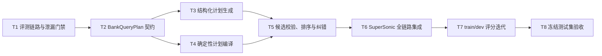

# BE-05 复杂 NL2SQL 增强实施规划

## 1. 规划结论

BE-05 不继续沿用“让大模型直接生成物理 SQL，再靠语法校验兜底”的主路线。首次真实模型盲测已经证明，这条路线可以得到较高的执行成功率，却不能保证业务结果正确：

| 基线 | 样本 | 解析成功率 | 执行成功率 | 结果一致率 |
| --- | ---: | ---: | ---: | ---: |
| Qwen3.6-35B 原始 Schema Prompt | 49 | 100% | 91.84%（45/49） | 0%（0/49） |

因此本任务采用以下技术路线：

```text
金融意图与 Mapper 结果
        ↓
LLM 生成结构化 BankQueryPlan（不直接写物理表 SQL）
        ↓
确定性校验：指标、机构、时间、过滤、排序、限制、口径
        ↓
确定性编译：简单查询走 QueryStructReq，复杂查询生成受控 S2SQL
        ↓
现有 DefaultSemanticTranslator 翻译物理 SQL
        ↓
只读/语法/翻译预检
        ↓
候选排序与至多一次的受控纠错
        ↓
JdbcExecutor 执行与统一评测
```

核心原则是：**大模型负责理解和选择，程序负责约束和计算**。任何候选都不得通过删除时间、机构、指标、过滤或排序条件来换取可执行性。

## 2. 目标、边界与完成标准

### 2.1 任务目标

- 支持单点、聚合、趋势、比较、TopN、阈值、同比、环比、较年初、比率、多指标、子查询、CTE 和窗口排名。
- 复用现有金融意图识别、Schema Mapper、S2SQL Translator、权限和执行链路。
- 将候选选择依据从“SQL 字符串投票”升级为“结构化语义完整性 + 可翻译性 + 确定性规则评分”。
- 输出可定位、可统计、可重试的标准错误分类与阶段耗时。
- 建立只使用 train/dev 的迭代评分闭环，最后再执行一次冻结测试集验收。

### 2.2 明确不做

- 不在 BE-05 内实现 BE-04 的十轮上下文合并。
- 不在 BE-05 内完成 BE-06 的完整 SQL 安全网关和 3 秒性能优化，但所有输出必须是只读查询，并记录分阶段耗时供 BE-06 使用。
- 不通过修改金标、扩大数值容差、忽略列顺序或删除查询条件提高分数。
- 不把测试集标准 SQL、标准结果、失败差异或样本级诊断放入模型提示词、few-shot、训练集或人工调优依据。
- 不启用现有 `LLMPhysicalSqlCorrector` 改写业务语义；它只允许在后续 BE-06 中做经过等价性验证的性能优化。

### 2.3 BE-05 完成门禁

以下条件必须同时满足：

1. 单元测试、契约测试、集成测试全部通过。
2. train/dev 数据访问边界测试通过，测试金标未进入开发链路。
3. 全量 dev（36 条）：
   - 解析/结构化输出成功率 100%；
   - SQL 执行成功率不低于 95%；
   - 执行结果一致率不低于 80%，目标值为 90%；
   - 复杂场景执行成功率不低于 90%；
   - 任一覆盖样本数不少于 5 的核心能力，结果一致率不得低于 60%。
4. 冻结 test（49 条）最终验收：
   - 解析成功率 100%；
   - 复杂 SQL 执行成功率不低于 90%；
   - 执行结果一致率不低于 80%，目标值为 90%；
   - 只读安全校验通过率 100%。
5. 所有失败都具有标准阶段、错误类别、候选摘要和重试次数；日志不记录模型隐式思维链或敏感结果数据。

“SQL 能运行”不是完成标准。若执行成功率达标但结果一致率未达到 80%，BE-05 仍判定未完成。

## 3. 现有链路与复用决策

### 3.1 直接复用

| 现有能力 | 位置 | BE-05 用法 |
| --- | --- | --- |
| 金融意图标准化 | `headless/chat/.../intent/BankIntentResult.java` | 作为结构化计划的先验约束 |
| 金融指标与机构映射 | `headless/chat/.../mapper/BankFinancialMapper.java` | 提供已确认的指标、机构和值映射 |
| LLM 策略工厂 | `SqlGenStrategy`、`SqlGenStrategyFactory` | 注册新的银行受控计划策略 |
| S2SQL 请求与响应 | `LLMReq`、`LLMResp` | 扩展语义提示和候选诊断字段 |
| 语义翻译器 | `DefaultSemanticTranslator` | 把受控 S2SQL 翻译成物理 SQL |
| 结构查询 | `QueryStructReq`、`StructQueryParser` | 承载单点、分组、聚合、排序等简单计划 |
| 工作流状态机 | `ChatWorkflowEngine` | 保留 Mapping → Parsing → Correcting → Translating 主流程 |
| 执行层 | `S2SemanticLayerService`、`JdbcExecutor` | 执行最终物理 SQL，不在核心执行器中加入银行特例 |
| DATA-02 评测器 | `evaluation/bank_nl2sql` | 统一比较列、行、顺序、精度与错误类别 |

### 3.2 需要修正的现有问题

- `OnePassSCSqlGenStrategy` 直接要求模型写 SQL，无法确定性约束业务口径。
- `ResponseHelper.selfConsistencyVote` 按原始 SQL 字符串投票，语义等价 SQL 会被拆散，错误 SQL 也可能因重复而胜出。
- `LLMResponseService` 使用“问题长度 × 投票权重”排序，不能代表语义正确性。
- `LLMSqlParser` 的重试逻辑硬编码 `OnePassSCSqlGenStrategy.APP_KEY`，新增策略后必须解除耦合。
- `PromptHelper.getFewShotExemplars` 在没有可用 exemplar 时会访问空列表末项，需要先补齐空集和确定性顺序测试。
- `QueryStructReq` 适合简单聚合，但不能单独覆盖同比、环比、窗口和多阶段 CTE，因此只作为混合编译器的一条输出路径。

### 3.3 否决的方案

| 方案 | 否决原因 |
| --- | --- |
| 只改 Prompt，继续生成物理 SQL | 盲测已经显示“91.84% 可执行、0% 正确”，语法正确不等于业务正确 |
| 只开启现有 LLM SQL Corrector | 仍由模型自由改 SQL，缺少指标、时间和过滤条件的硬约束 |
| 所有查询都转为 `QueryStructReq` | 无法完整表达 CTE、窗口、同比环比、复杂阈值筛选 |
| 用测试集失败样本做 few-shot | 造成评测泄漏，最终分数失去可信度 |
| 对失败 SQL 自动删除条件再重试 | 直接违反任务验收约束，可能产生越权或错误结果 |

## 4. 核心设计

### 4.1 `BankQueryPlan` 契约

模型输出 JSON 结构，不输出物理表名和任意 SQL 片段。计划至少包含：

```json
{
  "intent": "RANKING",
  "metrics": [
    {"bizName": "ZB001", "aggregation": "SUM", "alias": "各项存款余额"}
  ],
  "dimensions": ["org_name"],
  "organizations": [],
  "time": {
    "startDate": "2026-03-31",
    "endDate": "2026-03-31",
    "granularity": "DAY",
    "comparison": "NONE"
  },
  "filters": [],
  "calculation": {
    "type": "DIRECT",
    "baseline": "NONE"
  },
  "orderBy": [
    {"field": "ZB001", "direction": "DESC"}
  ],
  "limit": 3,
  "output": {
    "columns": ["org_name", "ZB001"],
    "orderSensitive": true
  }
}
```

契约规则：

- 指标只允许使用语义层 `bizName` 或已映射标识，不允许出现物理列名。
- 日期必须落为绝对起止日期；“同比/环比/较年初”同时保留比较类型和基期。
- 排名必须显式给出方向和 TopN。
- 输出列及顺序必须显式声明，因为评测器会比较列结构。
- 计划中禁止 DDL、DML、函数 SQL 字符串、任意 JOIN 条件和任意子查询文本。
- 低置信度或缺少必填槽位时输出 `CLARIFY`，但 DATA-02 的 200 道官方题均应能够执行，不能用澄清逃避复杂查询。

### 4.2 混合确定性编译

`BankQueryPlanCompiler` 根据计划类型选择两条路径：

- `STRUCT`：单点、普通聚合、趋势、TopN、简单阈值，编译为 `QueryStructReq`/受控基础 S2SQL。
- `S2SQL_TEMPLATE`：同比、环比、较年初、比率、多指标比较、窗口排名、嵌套聚合，使用固定 AST/模板生成 S2SQL，再交给现有语义翻译器。

编译器必须：

- 只从语义 Schema 解析表、指标、维度和关联路径。
- 根据指标定义选择默认聚合方式，禁止模型自行猜测 `SUM/AVG/MAX`。
- 固化日期边界、基期、列别名、列顺序和排序稳定性。
- 为 TopN 增加确定性次级排序，避免相同值导致结果漂移。
- 对比率、增幅和除法统一处理零分母、精度及单位。
- 生成查询指纹，语义等价计划得到同一指纹。

### 4.3 候选生成、硬校验与排序

每次最多生成 3 个结构化候选。默认先用温度 0 生成 1 个候选；只有硬校验失败时，才允许在受控配置下追加候选。

硬校验不通过的候选直接淘汰：

- 指标、维度、机构、值不在 Schema 或 Mapper 候选中；
- 计划意图与 `BankIntentResult` 冲突；
- 用户明确的时间、机构、指标、过滤、排序、TopN 有缺失或被放宽；
- 比较查询缺少基期，排名缺少方向，阈值缺少运算符；
- 生成非只读语句、跨越未授权数据集或超出最大明细限制；
- 编译或语义翻译失败。

通过硬校验后按以下证据排序：

| 证据 | 权重建议 |
| --- | ---: |
| 用户条件覆盖率 | 30 |
| Mapper/金融意图一致度 | 25 |
| 指标口径与聚合合法性 | 20 |
| 时间与比较基期完整性 | 15 |
| 编译、翻译与只读预检 | 10 |

不得把数据库返回值与金标差异作为线上候选排序信号。

### 4.4 错误分类与受控重试

错误沿用 DATA-02 的六个主类别：

- `MAPPING_ERROR`
- `METRIC_DEFINITION_ERROR`
- `JOIN_ERROR`
- `FILTER_ERROR`
- `SYNTAX_ERROR`
- `EXECUTION_ERROR`

评测阶段另记：

- `RESULT_MISMATCH`
- `CLARIFICATION_MISMATCH`

重试规则：

- 结构/映射/过滤错误：回到计划生成，携带结构化缺失项，不携带数据库结果。
- 语法/翻译错误：回到编译或选择下一候选，优先不再次调用模型。
- 可判定的数据库语法错误：只传递脱敏错误码和无对象值的摘要，最多一次。
- 权限拒绝、超时、连接失败、结果不一致：禁止模型自动重试。
- 全链路最多一次模型纠错，禁止无限重试或靠提高随机性碰运气。

生产执行反馈由新的服务层协调器包装 `parse → translate → execute`，不把银行特例写入 `S2SemanticLayerService` 核心执行逻辑。

### 4.5 可观测性

每次查询记录以下非敏感信息：

- `strategy`、`planVersion`、`candidateCount`、`selectedCandidate`；
- `intentType`、命中的指标/维度标识、编译路径；
- 每个候选的硬校验结果、评分项和淘汰原因码；
- `mappingMs`、`llmMs`、`compileMs`、`translateMs`、`executeMs`、`totalMs`；
- `retryCount`、错误阶段和标准错误类别；
- 查询指纹和配置版本。

不记录模型隐式思维链，不在普通日志中记录测试金标、完整查询结果或敏感维度值。

## 5. 实施任务图

拆分理由：评测链路、计划契约、生成器、编译器和候选选择均有独立交付物；生成器与编译器可在契约冻结后并行开发，但集成和评分必须串行过门禁。



关键路径：`T1 → T2 → T3/T4 → T5 → T6 → T7 → T8`。

### T1：SuperSonic 端到端评测链路与泄漏门禁

- 状态：进行中（2026-07-23）。端到端运行器、测试集访问门禁和本地最终运行登记已实现并通过测试。“银行问数”已绑定 `Text2SQL数据集`，且已核验该数据集含 21 个指标和 3 个维度。真实 dev 冒烟进一步修复了意图结果序列化、`IN` 条件字段替换、机构物理编码映射与指标别名归一化；当前未通过项为局域网模型连续返回不完整或非严格 JSON，导致结构化意图解析生成无效候选，不属于 Agent 或数据集配置问题。T1 保持进行中，待以稳定结构化输出取得一条可复现的实际 S2SQL、物理 SQL 和结果记录后关闭。
- Mode：`BDD_TDD`
- Dependency：DATA-02 已冻结数据和现有本地 H2/SQLite 标准库。
- Owner/Boundary：只修改 `evaluation/bank_nl2sql` 评测工具与测试，不改线上解析算法。
- 工作：
  - 新增 `run_supersonic_eval.py`，通过实际 `/api/semantic/query/chat/parse` 和执行接口评测，而不是直接请求模型。
  - 记录 Mapper、计划、S2SQL、物理 SQL、结果、耗时和标准错误类别。
  - 默认只允许 `train`、`dev`；读取 `test` 必须显式使用最终验收开关并增加运行计数。
  - 报告分为公开开发报告和受限样本诊断，防止测试金标进入调优视野。
- 预计文件：
  - `evaluation/bank_nl2sql/run_supersonic_eval.py`
  - `evaluation/bank_nl2sql/evaluation_policy.py`
  - `evaluation/bank_nl2sql/tests/test_run_supersonic_eval.py`
  - `evaluation/bank_nl2sql/README.md`
- Verification/Stop：
  - 金标回放仍为 100%；
  - 无授权读取测试金标必然失败；
  - 同一配置重复运行得到一致报告；
  - 无法获得实际 S2SQL、物理 SQL或结果时，不进入 T2。

### T2：`BankQueryPlan` 契约、JSON Schema 与验证器

- 状态：已完成（2026-07-23）。已新增版本化 `BankQueryPlan`、JSON Schema、从金融意图与语义 Schema 构建的只读 `SemanticIntentHints` 以及纯确定性 `BankQueryPlanValidator`。校验器会阻断物理 SQL/注入片段、未知指标/维度/机构/过滤字段、条件丢失、时间与比较基期错误、非法限制和不稳定排名；7 项契约测试通过。
- Mode：`BDD_TDD`
- Dependency：T1。
- Owner/Boundary：结构化查询计划和纯确定性校验，不调用模型、不执行 SQL。
- 工作：
  - 定义计划 DTO、枚举、版本字段和 JSON Schema。
  - 从 `BankIntentResult`、Mapper 结果和语义 Schema 构造只读 `SemanticIntentHints`。
  - 实现字段白名单、必填槽位、时间/基期、单位、输出列和限制校验。
  - 建立 8 类意图及异常契约用例。
- 预计文件：
  - `headless/chat/src/main/java/.../query/llm/s2sql/SemanticIntentHints.java`
  - `headless/chat/src/main/java/.../parser/llm/bank/BankQueryPlan.java`
  - `headless/chat/src/main/java/.../parser/llm/bank/BankQueryPlanValidator.java`
  - `headless/chat/src/test/java/.../parser/llm/bank/BankQueryPlanValidatorTest.java`
- Verification/Stop：
  - 正常、缺字段、幻觉字段、错误基期、条件丢失、非法限制和非只读注入测试全部通过；
  - 契约未冻结前，T3/T4 不写具体生成或编译逻辑。

### T3：结构化计划生成与安全 few-shot

- 状态：已完成（2026-07-23）。已新增默认关闭的 `BANK_CONSTRAINED_PLAN` 策略和独立 ChatApp；模型 Prompt 仅包含问题、金融意图、语义白名单和 JSON Schema，不包含物理表/字段、SQL 或动态示例。固定夹具可稳定解析为 `BankQueryPlan`，代码围栏可接受，坏 JSON、未知字段、条件缺失与模型异常均返回确定原因码；同时修复了 `PromptHelper` 在空 few-shot 下的下标越界。重试逻辑已从 `OnePassSCSqlGenStrategy.APP_KEY` 解耦。该策略暂不设为默认，待 T4 编译器完成后才进入端到端链路。
- Mode：`BDD_TDD`
- Dependency：T2。
- Owner/Boundary：从题目、Schema 和语义提示生成 `BankQueryPlan`；不输出物理 SQL。
- 工作：
  - 新增 `BANK_CONSTRAINED_PLAN` 策略和独立 ChatApp 配置。
  - 使用 JSON Schema/结构化输出，Prompt 只展示语义字段、指标口径和允许值。
  - few-shot 只从 train 召回；dev 只评分，test 完全隔离。
  - 修复 `PromptHelper` 空 exemplar 崩溃，固定召回排序和随机种子。
  - 将重试所需 App Key 从 `OnePassSCSqlGenStrategy` 解耦。
- 预计文件：
  - `LLMReq.java`、`LLMResp.java`
  - `LLMRequestService.java`
  - `ParserConfig.java`
  - `LLMSqlParser.java`
  - `PromptHelper.java`
  - `parser/llm/bank/BankPlanGenStrategy.java`
  - 对应单元与契约测试
- Verification/Stop：
  - 固定模型响应夹具可稳定反序列化；
  - 空 exemplar、坏 JSON、未知字段和模型超时均有确定错误；
  - 测试集内容进入 Prompt 的测试必须失败；
  - 不满足以上条件不调用真实模型批量评分。

### T4：确定性查询计划编译器

- 状态：进行中（2026-07-23）。已完成第一段可执行编译内核：`BankQueryPlanCompiler` 只从已验证的语义 Schema 解析标识符，直接聚合、趋势、TopN、阈值和多指标查询生成 `QueryStructReq`；单指标变化与显式双指标比率生成受控 S2SQL 模板，并支持按任意已验证的语义维度分组。分组变化会对当前期与基期的完整维度键等值连接；比率使用两阶段 CTE 先计算分子与分母、再计算百分比，避免语义翻译器在嵌套函数中遗漏指标展开。机构、时间、过滤、输出列顺序和零分母都由代码固定处理，Schema 展示名会归一为业务标识；未知机构语义维度、未选中排序字段、无法表示的过滤条件或计算都会明确拒绝。新增查询指纹，并修复 `QueryStructReq` 将分组转为 `HashSet` 而破坏列顺序的问题。本轮补齐了受控单点/排名的银行结果契约：执行后将已返回的语义宽表确定性投影为 `org_code, org_name, metric_code, metric_value[, rank_position]`；比率则投影为 `org_code, org_name, numerator_value, denominator_value, ratio_percent`，两者均不改写 SQL 或数值。排名计划必须使用机构维度，提示模板也固定采用该维度并保持“维度在前、指标在后”的输出列顺序。当前尚未覆盖多指标变化及其 H2/SQLite 翻译执行验证，因此新策略继续保持默认关闭。
- Mode：`BDD_TDD`
- Dependency：T2，可与 T3 并行。
- Owner/Boundary：`BankQueryPlan → QueryStructReq/S2SQL`，不负责 LLM 调用。
- 工作：
  - 实现 `STRUCT` 与 `S2SQL_TEMPLATE` 两条编译路径。
  - 覆盖单点、聚合、趋势、比较、TopN、阈值、同比、环比、较年初、比率、多指标和窗口排名。
  - 实现统一别名、列顺序、稳定排序、空值/零分母和精度规则。
  - 对生成 S2SQL 执行语法、只读和语义字段白名单校验。
- 预计文件：
  - `parser/llm/bank/BankQueryPlanCompiler.java`
  - `parser/llm/bank/BankS2SqlTemplateFactory.java`
  - `parser/llm/bank/BankPlanFingerprint.java`
  - 对应 golden/parameterized tests
- Verification/Stop：
  - 每类 SQL 能力至少一个先失败后通过的回归用例；
  - train/dev 金标可作为测试断言的执行结果来源，但不复制测试集金标；
  - 代表性查询在 H2 与 SQLite 上结果一致；
  - 任一编译路径可绕过语义字段白名单时立即停止。

### T5：候选校验、语义排序与受控纠错

- 状态：已完成（2026-07-24）。已实现候选硬校验、按语义证据的稳定排序、等价候选去重、全局最多一次纠错与安全候选诊断；模型失败、计划无效和下游执行错误均不会被隐式多次重试。对应单元测试已通过。
- Mode：`BDD_TDD`
- Dependency：T3、T4。
- Owner/Boundary：候选选择和错误策略，不修改数据库执行器。
- 工作：
  - 按查询指纹合并语义等价候选，替换原始 SQL 字符串投票。
  - 实现硬校验、分项评分、稳定 tie-break 和淘汰原因。
  - 调整 `SemanticParseInfo.score`，使其反映语义证据而非问题长度。
  - 实现最多一次的结构化纠错和脱敏反馈。
- 预计文件：
  - `parser/llm/bank/BankPlanCandidateRanker.java`
  - `parser/llm/bank/BankNl2SqlError.java`
  - `LLMResponseService.java`
  - `ResponseHelper.java`
  - 对应 ranking/retry tests
- Verification/Stop：
  - 条件完整的候选必须稳定胜过缺条件但可执行的候选；
  - 相同输入多次排序结果一致；
  - 权限、超时、结果不一致不会触发模型重试；
  - 重试次数超过 1 的测试必须失败。

### T6：SuperSonic 全链路集成、特性开关与回滚

- 状态：进行中（2026-07-24）。候选排序、去重、单次纠错、错误封装和安全诊断已接入 `LLMSqlParser → Translator → Executor`；解析响应保留路线、指纹、输出契约和候选摘要，但不记录原始模型输出。相关 Maven 回归为 82 通过、1 跳过。受控策略默认仍为单候选，现有服务行为不因候选机制而改变；剩余验证为非银行回归与关闭开关后的行为回滚。
- Mode：`BDD_TDD`
- Dependency：T5。
- Owner/Boundary：将新策略接入 Mapper → Parser → Translator → Executor；不做分数调优。
- 工作：
  - 注册 `BANK_CONSTRAINED_PLAN` 并暴露系统参数。
  - 新增服务层 `BankNl2SqlExecutionCoordinator`，承载 translate/execute 的受控反馈，不污染通用语义层。
  - 将候选诊断写入 `SemanticParseInfo.properties`，供后续 FE-03 展示。
  - 默认关闭新策略；通过配置可立即回退 `ONE_PASS_SELF_CONSISTENCY`。
- 预计文件：
  - `LLMReq.SqlGenType`
  - `ParserConfig.java`
  - `BankPlanGenStrategy.java`
  - `headless/server/.../BankNl2SqlExecutionCoordinator.java`
  - `/api/semantic/query/chat` 相关服务/控制器
  - 集成测试和配置说明
- Verification/Stop：
  - 本地 H2 上从自然语言到结果完整跑通；
  - 关闭开关后行为恢复现状；
  - 原有非银行数据集解析回归通过；
  - 未通过回滚测试，不进入真实模型评分。

### T7：train/dev 评分迭代

- 状态：进行中（2026-07-24）。完整 dev 已在可鉴权的真实“银行问数”链路运行。`dev-full-candidate-ranker-v6.json`：解析 100%（36/36）、执行 94.44%（34/36）、结果一致率 66.67%（24/36）；与此前 `dev-full-comprehensive-v4.json` 的解析/执行 100%、结果一致率 72.22%（26/36）相比，H-01/H-02 的执行结果不稳定，其中 H-01 已独立复现为成功。两次报告共同识别 10 条固定 `RESULT_MISMATCH`；它们涉及“前/后三”行数、同比/环比要求和题干指定机构与预期行不一致。由于 72.22% 仍未达到 80% 门槛，T7 不升级，且不读取或运行冻结 test。
- Mode：`SCORE_LOOP`，执行时使用 `ccdawn-score-loop` 工作流。
- Dependency：T6。
- Owner/Boundary：只基于 train/dev 调整 Prompt、校验、编译或排序；一次实验只改变一个主要机制。
- 迭代顺序：
  1. 10 条代表性 dev 冒烟：解析 100%、执行不低于 90%、结果不低于 70%；
  2. 全量 dev 36 条：结果一致率达到 80%；
  3. 按意图、难度、SQL feature 检查短板；
  4. 达到 80% 后冲击 90%，同时记录延迟。
- 每轮产物：
  - 配置快照、代码 commit、模型标识、数据 manifest；
  - 总体/分组指标、相对基线变化、错误类别分布；
  - 是否晋升为当前最佳候选及回滚点。
- Verification/Stop：
  - 连续两轮无提升则停止 Prompt 微调，转向确定性编译/映射根因；
  - dev 结果低于 80% 不得运行冻结 test；
  - 任何测试集样本级信息被用于调优时，本轮结果作废。

### T8：冻结测试集最终验收与交接

- Mode：`SIMPLE`，只运行已冻结版本，不现场改代码。
- Dependency：T7 全部门禁通过。
- Owner/Boundary：QA-01 最终评分和 BE-06/FE-03 交接。
- 工作：
  - 冻结 commit、配置、模型、数据 manifest 和数据库哈希。
  - 对 49 条 test 只运行一次最终端到端评测。
  - 输出聚合指标和受控错误报告。
  - 将分阶段耗时交给 BE-06，将候选诊断协议交给 FE-03。
- Verification/Stop：
  - 达到第 2.3 节门禁后标记 BE-05 完成；
  - 若未达标，不使用 test 样本进行定向修改；继续只能基于 train/dev，新的正式结论需要新的外部盲测集；
  - 最终报告必须标明此前原始模型基线和本次受控管线结果，禁止混用。

## 6. 测试矩阵

### T7 迭代记录（2026-07-23）

- 固定 10 条 dev 冒烟集：基线 0%（0/10）→ 输出契约 20% → 机构维度保留 30% → 比率 CTE 40% → 机构比较契约 50% → 年初变化快照 60%（6/10）。
- 当前候选报告：`evaluation/bank_nl2sql/reports/dev-smoke-10-change-snapshot-v1.json`；解析和执行成功率均为 100%，结果一致 60%。
- 已验证的真实路径：多机构比较使用“先聚合、外层筛选”CTE；年初变化以截止日快照对比年初前一日，均不向模型回灌 dev 金标。
- 当前 Gate：PROMOTE（相对上一候选 +10 个百分点）；尚未达到 70% 冒烟门槛，因此不运行冻结 test。下一优先级为季度趋势与省均值阈值的确定性模板；排名题的金标行数与“前三”语义不一致，需先独立确认契约后再改动。

### T8 迭代记录（2026-07-23）

- 省均值能力候选：`PROVINCE_AVERAGE` 由逻辑筛选条件编译为受控 CTE；阈值路径返回每家机构的指标、全省均值和命中标记，聚合路径先按机构/日期汇总再计算 `AVG/MIN/MAX/COUNT`，避免语义翻译器将统计函数错误下推为 `SUM`。
- 固定 10 条 dev 冒烟集：`change-snapshot-v1` 的 60%（6/10）→ `province-average-v1` 的 80%（8/10）；解析和执行成功率均为 100%。当前 Gate：PROMOTE，已满足 70% 冒烟门槛。
- 全量 dev（36 条）真实回归：解析 100%、执行 100%、结果一致率 55.56%（20/36）。报告：`evaluation/bank_nl2sql/reports/dev-full-province-average-v1.json`。未运行或读取冻结 test。
- 证据显示部分排名金标与题干机构不一致，例如题干指定 G/H/I 市农商行而预期行要求 J 市农商行；此类不一致不以篡改业务逻辑的方式修正。下一轮聚焦具有自洽契约的趋势和复杂变化能力，并把排名金标一致性作为独立数据质量决策项。

| 层级 | 测试内容 | 关键断言 |
| --- | --- | --- |
| DTO/Schema | JSON 结构、枚举、版本兼容 | 坏 JSON 和未知字段被拒绝 |
| Validator | 指标、机构、时间、过滤、排序、限制 | 用户条件不得缺失或放宽 |
| Compiler | 8 类意图与复杂 SQL feature | 固定计划得到固定 S2SQL/结果 |
| Security | DDL/DML、注入、越权数据集、超大 limit | 100% 阻断 |
| Ranking | 完整/缺失/幻觉/不可翻译候选 | 正确候选稳定第一 |
| Retry | 可重试与不可重试错误 | 最多一次，不传结果数据 |
| Integration | Mapper → LLM → Compiler → Translator | S2SQL、物理 SQL 与诊断完整 |
| Database | H2、SQLite | 同一计划结果一致 |
| Regression | 原有 OnePass、非银行数据集 | 特性开关关闭时无回归 |
| Evaluation | train/dev/test 访问策略 | test 未授权访问失败 |

## 7. 配置建议

首个可运行版本使用保守配置：

```properties
s2.parser.s2sql.strategy=BANK_CONSTRAINED_PLAN
s2.parser.format.json-type=json_schema
s2.parser.bank.max-candidates=1
s2.parser.bank.max-retries=1
s2.parser.bank.execution-feedback.enable=false
s2.parser.few-shot.number=3
s2.parser.self-consistency.number=1
```

只有当单候选硬校验的主要失败模式确认后，才把 `max-candidates` 提升到 2 或 3。执行反馈在 T5/T6 的安全测试通过前保持关闭。回滚只需把策略恢复为：

```properties
s2.parser.s2sql.strategy=ONE_PASS_SELF_CONSISTENCY
```

## 8. 数据与盲测纪律

- train 115 条：允许用于 few-shot、规则归纳和开发测试。
- dev 36 条：允许用于评分和错误分析，不进入 few-shot。
- augmentation 12 条：只用于鲁棒性和澄清测试，不计入官方分数。
- test 49 条：已有一次原始模型聚合基线；后续开发只保留聚合基线，不读取金标做定向修改。
- T8 前冻结所有代码和配置，再进行一次受控最终验收；T8 后该 test 不再用于迭代。
- 若最终验收失败，可以继续基于 train/dev 修复，但下一次“盲测提升”结论必须使用新的外部保留集。

## 9. 风险、触发条件与应对

| 风险 | 触发信号 | 应对 |
| --- | --- | --- |
| 意图识别先验错误放大 | 计划与题意稳定偏离、同类错误集中 | 保留候选意图并允许计划层纠偏；低置信度进入澄清 |
| 语义 Dataset 无法表达复杂口径 | 编译器需要物理字段或任意 SQL | 先补指标/维度定义，不绕过语义层 |
| Prompt 过拟合 dev | dev 上升但能力分组波动大 | 按 feature 分组门禁、一次只改一个机制 |
| 候选数增加导致延迟过高 | LLM 阶段超过总耗时预算 | 默认单候选，硬校验失败才追加；BE-06 再做缓存和并发 |
| H2 与目标数据库方言差异 | 翻译成功但目标库执行失败 | 编译器只生成 S2SQL，方言交给 Translator；增加方言集成测试 |
| 结果相同但列/顺序不一致 | 执行成功、评测仍 mismatch | 计划显式声明输出列和稳定排序 |
| 执行反馈泄露数据 | 日志或 Prompt 出现结果值 | 只传错误码和脱敏摘要，加入日志扫描测试 |
| 新策略影响通用场景 | 非银行数据集回归失败 | 策略按数据集/配置启用，保留一键回滚 |

## 10. 交付物

- 结构化 `BankQueryPlan`、JSON Schema、Validator、Compiler、Ranker。
- `BANK_CONSTRAINED_PLAN` LLM 策略和安全 few-shot 机制。
- 标准错误分类、候选诊断、阶段耗时和受控重试。
- SuperSonic 端到端银行 NL2SQL 评测脚本。
- 单元、契约、集成、数据库一致性和防泄漏测试。
- dev 评分迭代记录、最终 test 验收报告。
- 配置、启用、回滚和故障排查文档。

## 11. 执行顺序建议

下一步直接执行 **T1：SuperSonic 端到端评测链路与泄漏门禁**。原因是当前 0% 基线来自原始模型直连 Prompt，尚不能代表现有 SuperSonic 语义链路；若没有统一的端到端基准，后续所有优化都无法可靠比较。

T1 完成并证明评测边界正确后，再冻结 T2 契约。不要先大规模改 Prompt。
